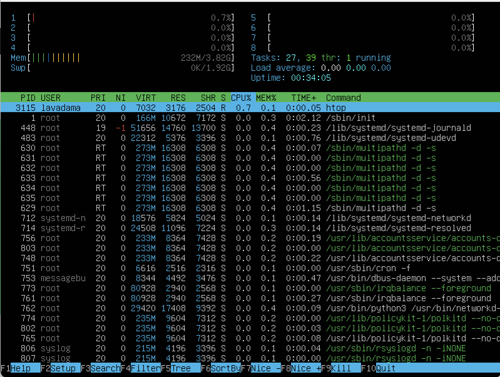

#Оглавление
1. [Part 1](#part-1-установка-ос)
2. [Part 2](#part-2-cоздание-пользователя)
3. [Part 3](#part-3-настройка-сети-ос)
4. [Part 4](#part-4-обновление-ос)
5. [Part 5](#part-5-использование-команды-sudo)
6. [Part 6](#part-6-установка-и-настройка-службы-времени)
7. [Part 7](#part-7-установка-и-использование-текстовых-редакторов)
8. [Part 8](#part-8-установка-и-базовая-настройка-сервиса-sshd)
9. [Part 9](#part-9-установка-и-использование-утилит-top-htop)
10. [Part 10](#part-10-использование-утилиты-fdisk)
11. [Part 11](#part-11-использование-утилиты-df)
12. [Part 12](#part-12-использование-утилиты-du)
13. [Part 13](#part-13-установка-и-использование-утилиты-ncdu)
14. [Part 14](#part-14-работа-с-системными-журналами)
15. [Part 15](#part-15-использование-планировщика-заданий-cron)

## Part 1. Установка ОС

Установка Ubuntu 20.04 Server LTS без графического интерфейса.

На картинке показана установленная версия Ubuntu

## Part 2. Создание пользователя

Cкриншот вызова команды для добавления нового пользователя

Скриншот команды для добавление пользователя в группу adm

Вывод команды `cat /etc/passwd`

## Part 3. Настройка сети ОС

**Сетевой интерфейс** — физическое или виртуальное устройство, предназначенное для передачи данных между программами через компьютерную сеть

**DHCP** — протокол автоматизации назначения IP-адреса клиенту. 

- Задано новое название машины: user-1

- Установка временной зоны по месту нахождения 

- Вывод названия сетевых интерфейсов с помощью консольной команды

Loopback Interface - на Unix-like системах lo или lo0 - виртуальный интерфейс, присутствующий по умолчанию в любом Linux. Он используется для отладки сетевых программ и запуска серверных приложений на локальной машине. 

- Получение ip адреса от DHCP-сервера

DHCP (англ. Dynamic Host Configuration Protocol — протокол динамической настройки узла) — прикладной протокол, позволяющий сетевым устройствам автоматически получать IP-адрес и другие параметры, необходимые для работы в сети TCP/IP.

gw: 192.168.64.1

ip адрес полученый от маршрутизатора 

Изменение данных с помощью команды sudo vim /etc/netplan/00-installer-config.yaml

Проверка измененного адреса 

Успешно пропингованные хосты 1.1.1.1 и ya.ru

## Part 4. Обновление ОС

Были использованы команды:
* sudo apt update
* sudo apt upgrade
* sudo apt autoremove
* sudo apt dist-upgrade
* sudo reboot

## Part 5. Использование команды sudo

**SUDO** - это важная для понимания утилита, она позволяет временно поднимать привилегии и выполнять задачи администрирования системы.

- установка пароля нового пользователя

- Изменение hostname от нового пользователя 

## Part 6. Установка и настройка службы времени

Для автоматической настройки времени я:  
* отключила стандартную утилиту командами   
    * sudo systemctl stop systemd-timesyncd   
    * sudo systemctl disable systemd-timesyncd  
* установила NTP  
    * sudo apt-get install ntp  
и перезагрузила систему 

## Part 7. Установка и использование текстовых редакторов

- Используя три редактора создать файлы и записать в них свой никнейм.

Редактор vim

Для выхода и сохранения изменений 'esc' + :wq!

Редактор nano

Для выхода и сохранения изменений 'control' + O затем 'control' + X

Редактор MCEDIT

Для выхода и сохранения изменений 'esc' -> yes

- Используя каждый редактор, открыть файл и заменить никней на строчку "21 school 21". Закрыть без сохраненияю

Редактор vim

Для выхода без сохранения изменений 'esc' + :q!

Редактор nano

Для выхода без сохранения изменений 'control' + X -> no

Редактор MCEDIT

Для выхода без сохранения изменений 'esc' -> no

- Открыть файл и освоить функцию поиска и замены слова в трех редакторах 

Редактор vim

Для поиска и замены :s/lavadama/school

Редактор nano

Для поиска и замены:
Ctrl+W или F6 - Искать текст или регулярное выражение
Ctrl+\ или m+R - Заменить текст или регулярное выражение -> yes

Редактор MCEDIT

Для замены F4, для поиска F7

## Part 8. Установка и базовая настройка сервиса SSHD

- Установка

- Добавить автостарт
sudo systemctl enable ssh

- Перенастроить службу SSHd на порт 2022

- Используя команду ps, показать наличие процесса sshd. Для этого к команде нужно подобрать ключи. 

- Используем команду ps axvf | grep sshd**  
Значение: ps - отображение текущих процессов на экране пользователя.  
ax - показать все процессы.  
-f - полноформатный вывод (отвечает за форматирование).   
-v - показывает формат виртуальной памяти.  
grep sshd - находит на вводе строки регулярное выражение sshd и выводит их. 

- Перезагрузить систему.  
sudo systemctl restart ssh  

- Вывод команды netstat -tan
-n - Отображение адресов и номеров портов в числовом формате.  
-a - Отображение всех подключений и ожидающих портов.  
-t - Отображение текущего подключения в состоянии переноса нагрузки с процессора на сетевой адаптер при передаче данных.  
**Proto:** Протокол (tcp, udp, raw), используемый сокетом.  
**Recv-Q:** Счётчик байтов, не скопированных программой пользователя из этого сокета.  
**Send-Q:** Счётчик байтов, не подтверждённых удалённым узлом.  
**Local Address:** Адрес и номер порта локального конца сокета.  
**Foreign Address:** Адрес и номер порта удалённого конца сокета.  
**State:** Состояние сокета.  

**IP-адрес 0.0.0.0** — это немаршрутизируемый адрес IPv4, который можно использовать в разных целях, в основном, в качестве адреса по умолчанию или адреса-заполнителя. Он не является адресом какого-либо устройства.  

## Part 9. Установка и использование утилит top, htop

### Вывод команды _top_

**Up** — время работы системы с последнего запуска. ***В работе: 0:32***

**User** — количество текущих пользователей. ***В работе: 1 пользователь***

**Load average** — средняя нагрузка на сервер: отображаются значения за одну, пять и 15 минут назад. ***В работе: 0 загрузка сервера***

**Tasks** — общее количество запущенных процессов в разных статусах (running — выполняемые; sleeping — в ожидании; stopped — остановленные; zombie — «зомби», дочерние процессы, ожидающие завершения родительского процесса). ***В работе: 0 запущенных процессов***

**Cpu(s)** — процент времени процессора, затраченного на выполнение процессов, в том числе: ***В работе: 0***

**us** — пользовательские процессы (высокое значение данного показателя может указывать, в том числе, на проблемы в коде сайта, необходимость его оптимизации);

**sy** — процессы ядра;

**id** — неиспользуемые ресурсы (чем выше этот показатель, тем лучше);

**wa** — операции ввода/вывода, т.е. дисковые операции.

**Mem, Swap** — сведения об использовании оперативной памяти (total — общий объем, free — объем свободной памяти, used — объем использованной памяти). ***В работе: 3916,2 total, 3160,6 free, 232,1 used***

### Значение столбцов

PID — идентификатор процесса;

USER — пользователь, запустивший процесс;

PR — приоритет процесса;

NI — измененный приоритет (присвоенный пользователем с помощью команды nice);

VIRT — объем используемой виртуальной памяти (здесь выводится тот объем памяти, который был запрошен процессом, даже если фактически используется меньше);

RES — объем используемой оперативной памяти (в данном случае, если процесс запросил 50Мб памяти, а использует 10Мб, будет выведено 10Мб);

SHR — объем памяти, разделяемой с другими процессами (т.е.  память, которая может быть использована другими процессами);

S — статус процесса (running — запущен; sleeping — в ожидании; zombie — процесс-«зомби»);

%CPU — процент использования процессорного времени;

%MEM — процент использования оперативной памяти;

TIME — общее время работы процесса;

COMMAND — имя процесса (команда, которой был запущен процесс).

*Процесс занимающей больше всего памяти PID - 1, USER - root *

### Вывод команды _htop_ 

Для управления сортировкой можно использовать клавиши M (сортировка по памяти), P (по процессору), T (по времени), аналогично утилите top.

Дополнительно используются:

Пробел — отметить процесс (таким образом можно помечать процессы для групповой операции с ними, например, завершения).

u — вывести процессы конкретного пользователя.

Для управления используются клавиши F1 – F10:

F1 — вывод справки

F2 — настройка вывода (добавление, удаление столбцов, отображение расширенной информации в верхнем блоке и пр.)

F3 — поиск процессов

F4 — фильтрация процессов (вывод процессов, имеющих в названии указанное слово)

F5 — вывод дерева процессов (родительские и дочерние процессы)

F6 — изменить тип сортировки

F7 / F8 — повышение / понижение приоритета

F9 — завершение процесса (в отличие от top, не требуется указание PID — просто выделите с помощью мыши или клавиатуры нужный процесс и нажмите F9. Для подтверждения завершения процесса нажмите Enter, для отмены — Esc).

F10 — выход из программы

### Сортировка процессов: 
(Для сортировки нажать F6)

По PID: 
По PERCENT_CPU: 
По PERCENT_MEM: 
По TIME: 

Отфильтрованному для процесса sshd:
нажать F4 

с процессом syslog, найденным, используя поиск 
Нажать F3 

Вывод с добавлением: 

## Part 10. Использование утилиты fdisk

запустить команду fdisk -l

Название жесткого диска: `/dev/vda`, его размер: 20 GB, количество секторов: 3

## Part 11. Использование утилиты df

Запустить команду df. 
Единицы измерения килобайты

Запустить команду df -Th. 
Тип файловой системы ext4

## Part 12. Использование утилиты du 

* sudo du -s /home
* sudo du -sh /home
* sudo du -s /var 
* sudo du -sh /var 
* sudo du -s /var/log
* sudo du -sh /var/log 

* du -ha /var/log

## Part 13. Установка и использование утилиты ncdu

sudo ncdu /home 
sudo ncdu /var 
sudo ncdu /var/log 

## Part 14. Работа с системными журналами

the last successful login time: Aug 23 14:22;
user name: lavadama;
login method: as root (uid = 0);

Перезапустить службу SSHd.
Команда sudo systemctl restart ssh

sudo less /var/log/syslog проверка последних логов (перемещение по странице g - вверх, G - вниз)

## Part 15. Использование планировщика заданий CRON

Командой sudo systemctl enable cron задаем работу CRON в фоновом режиме.  

  
Содержимое журнала /var/log/syslog со строчками о выполнении команды uptime каждые 2 минуты.  

crontab -l - вывести экран список текущих заданий для CRON, crontab -e - редактирование файла с задачами (результат редактирования ниже).  

  

Удаление всех задач 
